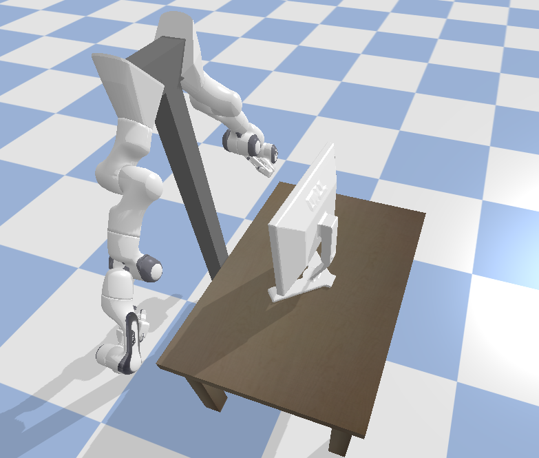
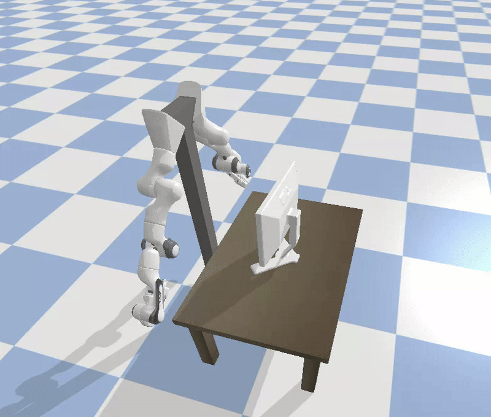

<div align="center">
  <h1>Dual Arm PyBullet Simulation</h1>
  <p><strong>Interactive simulation environment for dual-arm grasping and manipulation research.</strong></p>
  
  
  
</div>

<br>
<div align="center">
  
</div>

---

## 📖 Overview

This repository provides a highly structured, interactive **PyBullet simulation environment** designed for dual-arm grasping tasks using two Franka Panda manipulators. 

It allows researchers and developers to intuitively load object meshes, visualize and evaluate candidate grasps from the DG16M dataset, assign them interactively to specific arms, and seamlessly compute Inverse Kinematics (IK) to physically drive the robots into pre-grasp configurations.

---

## 🎥 Demo

<div align="center">
  
</div>

---

## 🚀 Features

- **Interactive Grasp Selection**: Visually explore thousands of grasp poses via keyboard controls.
- **Physics-Based Collision Checking**: Only valid, collision-free grasps are filtered for the user.
- **Dual Arm Coordination**: Built-in state machine for assigning grasps independently to the left and right arms.
- **Robust Inverse Kinematics (IK)**: Automatically solves and moves both arms to safe pre-grasp positions respecting joint limits.
- **Configuration-Driven**: Easily swap out objects, URDFs, and offsets via `configs/scene.yaml`.

---

## 📂 File Structure

```text
dual_arm_pybullet/
├── assets/
│   ├── grasps/      # Decoupled grasp dataset files (.h5)
│   ├── meshes/      # Object mesh files (.obj)
│   └── urdf/        # Robot models and configurations
├── configs/
│   ├── scene.yaml   # Main simulator settings and object parameters
│   └── joint_limits.yaml 
├── img/             # Documentation media (GIFs, PNGs)
├── pyproject.toml   # uv package and dependency management
└── src/
    ├── dual_arm/
    │   ├── dataset/     # Grasp dataset loaders (e.g., dg16m.py)
    │   ├── grasping/    # Logic (IK, arm assignment, collision, visualizer)
    │   ├── simulator/   # Modular PyBullet environment (world, robots, objects, animation, etc.)
    │   └── utils/       # Helpers (transforms, config parsing, visualization)
    └── main.py      # Entry point for the interactive state machine
```

---

## 🛠️ Installation & Setup

1. **Clone the repository:**
   ```bash
   git clone <your-repo-url>
   cd dual_arm_pybullet
   ```

2. **Initialize the virtual environment & install dependencies (using `uv`):**
   ```bash
   uv venv
   uv sync
   ```

3. **Run the simulation:**
   ```bash
   cd src
   python main.py
   ```

---

## 🎮 Controls (PyBullet Window)

Once the simulation starts, use the following keyboard commands to interact with the environment:

| Key | Action |
| --- | ------ |
| **`Y`** | Progress to the next simulation phase (e.g., start assignment, execute IK). |
| **`R`** | Instantly **restart** the entire simulation from scratch. |
| **`K`** | Show the **next** collision-free grasp. |
| **`J`** | Show the **previous** collision-free grasp. |
| **`L`** | Show a **random** grasp (may be accepted or rejected). |
| **`A`** | **Assign** the currently displayed grasp to the highlighted arm. |

---

## ⚙️ Pipeline Overview

1. **Initialization**: Loads configurations, spawns the PyBullet world, Panda arms, and target object.
2. **Visualization**: A "ghost gripper" visually represents candidate grasps, while a hidden "collision gripper" checks for physics intersections.
3. **Exploration**: The user uses `J`, `K`, `L` to cycle through the dataset.
4. **Assignment**: Pressing `A` assigns a valid grasp to the Left Arm (highlighted green), then switches focus to the Right Arm.
5. **Execution**: After both arms receive assignments, visualizers are hidden, IK is computed for a "pre-grasp" approach vector, and the arms smoothly transition into place.

---

## 📝 Roadmap / To Do

- [x] Add self-collision filters individually for each arm.
- [x] Configure bimanual humanoid torso setup with mirrored outward-facing kinematics.
- [x] Implement mathematical grasp target plunging for IK solvers.
- [ ] Establish grasping sequence (approaching the object, closing the grippers, and lifting).
- [ ] Introduce accurate coefficients of friction for the object and the gripper pads.

*(See [CHANGELOG.md](CHANGELOG.md) for past updates and fixes).*

---

<div align="center">
  <i>Built for Advanced Agentic Robotics Research</i>
</div>